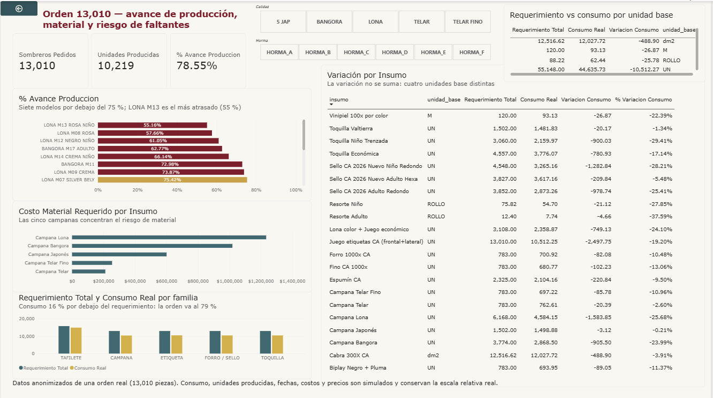

# Proyecto A — Orden de producción: ¿alcanza el material para 13,010 sombreros?

> Modelo dimensional y dashboard en Power BI sobre una orden real de una fábrica de sombreros:
> 17 modelos, 13,010 piezas, 21 insumos. Datos anonimizados.

**Aviso sobre los datos.** La orden, los modelos, los insumos, los factores de consumo y la estructura de armado son **reales y anonimizados**: cliente y hormas renombrados, modelos codificados. Las columnas con prefijo `sim_` — consumo real, unidades producidas, fechas, costos y precios — son **simuladas**, y conservan la escala relativa real del producto, no los valores absolutos. Los costos de este repositorio **no son precios de proveedor**. El mapeo entre nombres reales y anónimos no vive en ningún repositorio.

---

## Problema

Cuando entra un pedido de N sombreros, compras necesita una sola cosa antes de poder pedir nada: el requerimiento total de material, insumo por insumo, en la unidad de cada insumo. Hoy eso se resuelve a mano — un analista explota la ficha técnica modelo por modelo en plantillas de Excel y entrega tablas corroboradas a quien pone el pedido.

Esta orden trae 13,010 sombreros repartidos en 17 modelos. Las preguntas que hay que poder contestar son tres:

1. ¿Cuánto material pide la orden y cuánto se ha consumido?
2. ¿Qué tan avanzada va la producción, y qué modelos van atrasados?
3. ¿Qué insumo pone la orden en riesgo?

## Enfoque

**Modelo estrella**, no una hoja plana. Una tabla de hechos `f_consumo` con **85 filas** — 17 modelos × 5 familias de insumo, porque cada modelo lleva exactamente un insumo de cada familia — y tres dimensiones: `d_modelo` (17 filas), `d_insumo` (21) y `d_calendario`. Tres relaciones `1:*`, todas de dirección única hacia los hechos. **13 medidas DAX.**

El detalle completo —diccionario de tablas, las 13 medidas comentadas, el diagrama y lo que el modelo *no* responde— está en **[`modelo-de-datos.md`](modelo-de-datos.md)** ([English](modelo-de-datos.en.md)).

Las decisiones de diseño que importan, y por qué:

- **`cantidad_sombreros` vive solo en `d_modelo`, no en los hechos.** Si estuviera en `f_consumo`, alguien sumaría 65,050 sombreros en vez de 13,010, porque cada modelo aparece cinco veces (una por familia de insumo). Resolverlo con un `SUMX` habría funcionado y habría dejado la trampa puesta; sacar la columna la elimina.
- **`Unidades Producidas` es semi-aditiva.** El valor se repite en las cinco filas del modelo, así que se colapsa con `SUMX ( VALUES ( d_modelo[id_modelo] ), CALCULATE ( MAX (...) ) )`. Un `SUM` directo devuelve 51,095 en vez de 10,219 — y devuelve un número que se ve perfectamente creíble.
- **El herraje dejó de ser familia propia.** Se modeló primero como familia aparte; operación aclaró que en este producto va plegado dentro de la toquilla y solo en algunos modelos, así que la columna habría sido casi toda nula. Ningún patrón técnico salva un modelo que contradice al negocio.
- **El color es atributo de `d_modelo`, no dimensión propia.** *Japonés Panal Natural* y *Japonés Panal Bicolor* son dos modelos distintos del catálogo, no un modelo con dos colores.
- **Tres familias se agregaron al archivo original** porque no venían listadas y sin ellas el costo describe otro producto: campana, etiqueta y herraje.

## Resultado

Una página con los tres bloques que pedía el negocio: avance de producción (13,010 pedidos · 10,219 producidos · **78.55 %**), requerimiento contra consumo real, y concentración de costo por insumo. Siete modelos van por debajo de la meta del 75 %; el más atrasado es LONA M13, al 55 %.

Pero lo que este proyecto tiene que contar no son los KPIs. Son tres hallazgos que el dato no traía puestos.

### Hallazgo 1 — un total bien calculado que no significa nada

`Variacion Consumo` da **−11,053.80** y está perfectamente calculado. También está sumando unidades con rollos, con metros y con decímetros cuadrados: `d_insumo[unidad_base]` tiene cuatro valores distintos. Es aritmética válida sobre magnitudes incompatibles — como sumar kilos con litros.

Había cuatro salidas razonables: mostrarlo en porcentaje, filtrarlo a una sola unidad, convertirlo a dinero, o partirlo por unidad. **Se retiró de la tarjeta grande y se partió por `unidad_base`**, y además esa columna se puso en la tabla de detalle. El dashboard *enseña* por qué el total no se puede leer, en vez de esconder el problema detrás de un KPI limpio. Un dashboard que oculta el defecto del dato es peor que uno que lo declara.

Filtrado a `unidad_base = 'UN'`, el requerimiento es de **55,148** piezas. Ese sí es un número que se le puede pedir a un proveedor.

### Hallazgo 2 — la alerta de faltantes no venía en el dato: hubo que definirla

Las dos definiciones evidentes de "insumo en riesgo" no discriminan nada:

| Definición | Insumos marcados |
|---|---|
| `stock_inicial` < requerimiento | **21 de 21** |
| `stock_inicial + pedido_pendiente` < requerimiento | **2 de 21**, y esos dos por centésimas de redondeo |

Una grita por todo y la otra calla por todo. Implementando una sola, el problema es invisible; puestas las dos juntas, queda claro que ninguna sirve.

La tercera definición se ancló al **proceso físico, no al dato**: la campana bloquea Hormado → Dope → Secado. Sin campana no hay sombrero que retrasar; sin toquilla hay miles esperando en secado. Ese argumento no sale de ninguna columna del archivo — sale de conocer el piso de la fábrica.

Y se implementó como **ranking por dinero en riesgo**, no como filtro fijo a `familia = CAMPANA`. La campana sube sola al primer lugar porque concentra el costo. Fijarla a mano daba exactamente el mismo visual hoy, y una alerta muerta el día que cambien los datos.

### Hallazgo 3 — la campana concentra el 88.99 % del costo de material

Casi nueve de cada diez pesos de material están en un solo insumo. Eso reordena dos cosas de la operación: cualquier ahorro real se negocia en la campana y no en los otros veinte insumos, y una campana perdida en el almacén cuesta un orden de magnitud más que cualquier otra merma.

**Su límite, dicho de frente:** los costos son `sim_` y conservan la escala relativa real, así que el hallazgo es de **concentración**, no de monto. El porcentaje es defendible; los pesos no.

### En una frase, sin tecnicismos

El programa me daba un número perfectamente calculado —"faltan 11,053 unidades de material"— que en realidad no quería decir nada, porque estaba sumando piezas con rollos, con metros y con centímetros cuadrados. Y cuando quise poner el semáforo de qué material falta, descubrí que las dos formas obvias de calcularlo eran inútiles: una marcaba en rojo los veintiún materiales y la otra no marcaba ninguno. El dato no traía la alarma adentro; tuve que definir yo qué cuenta como faltante, y la definí por lo que de verdad para la línea de producción — la campana, que es la base del sombrero y bloquea los tres procesos siguientes. Esa parte no la saca ningún programa: la sé porque conozco el piso de la fábrica.

---

## Qué hay en esta carpeta

| Archivo | Qué es |
|---|---|
| [`modelo-de-datos.md`](modelo-de-datos.md) · [`.en.md`](modelo-de-datos.en.md) | Documentación del modelo: grano, diccionario de tablas, las 13 medidas DAX comentadas, decisiones de diseño y lo que el modelo **no** responde |
| [`proyecto_a_modelo_de_datos.pbix`](proyecto_a_modelo_de_datos.pbix) | El archivo de Power BI: modelo, medidas y dashboard, abribles |
| [`capturas/dashboard.png`](capturas/dashboard.png) | La página del dashboard |
| [`datos/Pedido_Insumos_ANONIMIZADO.xlsx`](datos/Pedido_Insumos_ANONIMIZADO.xlsx) | El dataset anonimizado: tres hojas de 17, 21 y 85 filas |
| [`modelo.png`](modelo.png) | Diagrama del esquema estrella |

**Reproducir:** abrir el `.pbix`; carga el `.xlsx` vía Power Query y construye las cuatro tablas. Números de control: `f_consumo` con 85 filas, cero nulos en `id_insumo`, `Sombreros Pedidos` = 13,010.

*English version: [README.en.md](README.en.md)*
