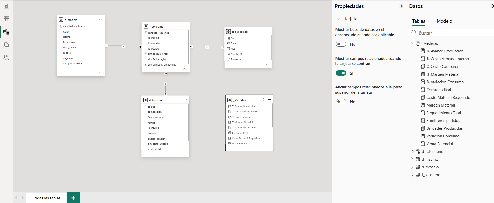

# Project A — Dimensional data model: hat-making supply order

> Star schema in Power BI over a real production order (17 models, 13,010 hats),
> with 13 DAX measures. Data is anonymized; `sim_` columns are simulated and declared below.

---

## 1. Business problem

When an order for N hats comes in, Purchasing needs a bill of materials per model as the
main driver of the requirement: it breaks down each model into every component to get a
per-supply subtotal, in its own unit, that satisfies that order.

Today that's solved by an analyst doing the material explosion by hand per model, using
Excel templates and AI assistance, then handing corroborated tables and quantities to
whoever places the requirement order.

This model lets you feed in the bill of materials and get the total requirement quickly,
along with the KPIs the business needs for sustainability and future investment decisions.

---

## 2. Data source

Real supply order sheet from a hat factory (León / San Francisco del Rincón, Gto., Mexico),
order 150: 17 models, 13,010 pieces.

Anonymization — script `anonimizar_y_aumentar.py`, reproducible, fixed seed `13010`:

| What | How |
|---|---|
| Client | Name and initials replaced with `CLIENTE_A` / `CA` |
| Models | Renamed to `<LINE> M01…M17`, keeping quality line and segment |
| Molds (hormas) | Renamed to `HORMA_A`…`HORMA_F` |
| Costs and prices | Simulated; keep the real **relative scale**, not the absolute values |

The real-name → anonymized-name mapping **does not live in this repository**.

Three supply families were added to the original file because they weren't listed, and
without them the cost analysis describes the wrong product:

- **CAMPANA (bell/crown)** — implicit in the model name (Bangora / 5 Jap / Telar / Lona). It's ~89% of material cost.
- **ETIQUETA (label)** — front + side set, applies to all 13,010 pieces.
- **HERRAJE (hardware)** — nickel hardware set; later **folded into the toquilla** (see §8).

---

## 3. Simulated-data notice

Columns prefixed `sim_` — real consumption, units produced, registration date, unit cost,
and sale price — are simulated. Models, molds, supplies, codes, quantities, requirements,
and the assembly structure are real and anonymized. Costs follow the product's real
relative scale (the bell ≈89% of material cost; the rest in descending order: leather,
lining, toquilla, hardware, seal, label), but their absolute values are not supplier
prices. Per-line sale prices are the real catalog prices. The simulation exists to
demonstrate the dimensional model and DAX measures; once the order's real settlement data
is available, these columns get swapped in without changing the model.

---

## 4. Grain

One row of `f_consumo` represents the requirement and consumption of **one supply, for one
model, within one order**.

That sentence implies exactly 85 rows: 17 models × 5 supply families, because every model
carries exactly one supply from each family.

---

## 5. Table dictionary

### `f_consumo` — fact table (85 rows)

| Column | Role | Note |
|---|---|---|
| `id_pedido` | degenerate dimension | lives in the fact table, has no dimension of its own |
| `id_modelo` | FK → `d_modelo` | |
| `id_insumo` | FK → `d_insumo` | resolved by **(family, code)**, not code alone |
| `sim_fecha_registro` | FK → `d_calendario` | simulated |
| `cantidad_requerida` | **measure** | calculated: hats × `factor_consumo` |
| `sim_consumo_real` | **measure** | simulated |
| `sim_unidades_producidas` | **measure** | simulated, **semi-additive** (see measure 6) |

### `d_modelo` — dimension (17 rows)

`id_modelo · modelo · horma · linea_calidad · color · segmento · cantidad_sombreros · sim_precio_venta`

`cantidad_sombreros` and `sim_precio_venta` live **only here**, not in the fact table. Deliberate (see §8).

### `d_insumo` — dimension (21 rows)

`id_insumo · familia · codigo · insumo · unidad_base · factor_consumo · sim_costo_unitario · stock_inicial · pedido_pendiente · tipo_abastecimiento · composicion`

### `d_calendario` — date dimension

`Date · año · mes · nombre_mes · trimestre` — the key is `Date`.

### Relationships

Three, all `1:*` and **single-direction**, from dimension to fact table:

| From | To |
|---|---|
| `d_modelo[id_modelo]` | `f_consumo[id_modelo]` |
| `d_insumo[id_insumo]` | `f_consumo[id_insumo]` |
| `d_calendario[Date]` | `f_consumo[sim_fecha_registro]` |

---

## 6. Diagram



`f_consumo` at the center, the three dimensions around it. All three relationships are
`1:*` and single-direction toward the fact table; no line crosses another, which is how
you confirm at a glance that the schema is a star, not a snowflake.

---

## 7. Measures

All 13 live in an empty `_Medidas` table so they don't scatter across the data tables.

```dax
-- 1. Lives in d_modelo (one row per model), so SUM is safe.
Sombreros Pedidos = SUM ( d_modelo[cantidad_sombreros] )

-- 2. Unfiltered by unit, this number mixes dm², meters, rolls and UN. See Finding 1.
Requerimiento Total = SUM ( f_consumo[cantidad_requerida] )

-- 3.
Consumo Real = SUM ( f_consumo[sim_consumo_real] )

-- 4. Negative = less consumed than required (order not finished yet).
Variacion Consumo = [Consumo Real] - [Requerimiento Total]

-- 5. DIVIDE protects against a zero denominator; "/" would return infinity.
% Variacion Consumo = DIVIDE ( [Variacion Consumo], [Requerimiento Total] )

-- 6. Semi-additive: the value repeats across the model's 5 rows.
--    A plain SUM would give 51,095 instead of 10,219.
Unidades Producidas =
SUMX (
    VALUES ( d_modelo[id_modelo] ),
    CALCULATE ( MAX ( f_consumo[sim_unidades_producidas] ) )
)

-- 7.
% Avance Produccion = DIVIDE ( [Unidades Producidas], [Sombreros Pedidos] )

-- 8. Has to be SUMX: unit cost varies by supply, so it's multiplied
--    row by row BEFORE summing. SUM(req) * SUM(cost) means nothing.
Costo Material Requerido =
SUMX ( f_consumo,
       f_consumo[cantidad_requerida] * RELATED ( d_insumo[sim_costo_unitario] ) )

-- 9.
Venta Potencial =
SUMX ( d_modelo, d_modelo[cantidad_sombreros] * d_modelo[sim_precio_venta] )

-- 10.
Margen Material = [Venta Potencial] - [Costo Material Requerido]

-- 11.
% Margen Material = DIVIDE ( [Margen Material], [Venta Potencial] )

-- 12. ALL clears the family filter in the denominator: the percentage stays
--     over the grand total even when the visual is sliced.
% Costo Campana =
DIVIDE (
    CALCULATE ( [Costo Material Requerido], d_insumo[familia] = "CAMPANA" ),
    CALCULATE ( [Costo Material Requerido], ALL ( d_insumo[familia] ) )
)

-- 13. Same pattern, over the sourcing-type axis.
% Costo Armado Interno =
DIVIDE (
    CALCULATE ( [Costo Material Requerido],
                d_insumo[tipo_abastecimiento] = "Armado interno" ),
    CALCULATE ( [Costo Material Requerido], ALL ( d_insumo[tipo_abastecimiento] ) )
)
```

### What each one answers

| Measure | Question it answers | Value (unfiltered) |
|---|---|---|
| Sombreros Pedidos | How many pieces does the order carry? | 13,010 |
| Requerimiento Total | How much material do we need to have on hand? *(only valid sliced by unit)* | 67,872.82 |
| Consumo Real | How much material has been consumed? | 56,819.02 |
| Variacion Consumo | How much is left to consume? | −11,053.80 |
| % Variacion Consumo | What proportion? | −16.29 % |
| Unidades Producidas | How many hats are finished? | 10,219 |
| % Avance Produccion | How far along is the order? | 78.55 % |
| Costo Material Requerido | How much money in material does this order call for? | 3,729,822.00 |
| Venta Potencial | What's the order worth if sold in full? | 10,400,650.00 |
| Margen Material | What's left after material cost? | 6,670,828.00 |
| % Margen Material | What proportion? | 64.14 % |
| **% Costo Campana** | Where is the cost concentrated? | **88.99 %** |
| % Costo Armado Interno | How much cost goes through in-house assembly? | 1.52 % |

---

## 8. Design decisions

### 8.1 Color is an attribute of `d_modelo`, not its own dimension

Color belongs to the model's attributes — Japones Panal Natural is a different model from
Japones Panal Bicolor. It was decided this way because there usually aren't many color
variants per model; most are a single color (it isn't even in the name as "natural").

### 8.2 `cantidad_sombreros` and `sim_precio_venta` live only in `d_modelo`

Keeping these columns in the `f_consumo` fact table (where quantities get summed) could
lead to the error of summing the true hat count five times over, because there are 5
supply families per model. Fixing it with a SUMX wouldn't hide the trap — someone could
still sum them directly. Keeping them out of the fact table removes that possibility.

### 8.3 `sim_unidades_producidas` does stay in the fact table

Because the model is built on event-level records, its produced-units measure does need
to be summed per model to calculate progress or other KPIs shown to managers. An event is
the requirement and consumption of one model by one supply across five families, so one
model's order yields five events.

### 8.4 Hardware stopped being its own family

Hardware was first modeled as a separate family. Operations (Joey) pointed out that this
particular hardware was part of the final toquilla and applied to only a few models, so
the hardware column would have been mostly null or "no hardware" for most rows. This is
where the general principle applies: "no technical pattern rescues a model that
contradicts the business."

---

## 9. Findings

### Finding 1 — total requirement mixes units and can't be handed to a supplier

`Requerimiento Total` unfiltered gives 67,872.82, and that number means nothing: it sums
dm², meters, rolls and units. Four of the five families report a single unit; **TAFILETE**
breaks into several:

| Supply | Unit | Factor per hat |
|---|---|---|
| Cabra 300x | dm² | 8.3333 |
| Vinipiel | m | 0.03861 |
| Resorte | roll | 1/60 |
| Espumín, Fino | UN | 1 |

Filtered to `unidad_base = 'UN'`: **55,148**.

If the visual isn't filtered by base unit it lies — the number means nothing because you
can't sum different base units. That's exactly the mistake an analyst makes publishing
67,872.82 as a KPI: they couldn't even say what unit it's in.

### Finding 2 — the bell (campana) concentrates 89% of material cost

That nearly 90% of a hat's manufacturing cost is the CAMPANA supply suggests everything
else is far less influential, and any savings initiative should target the bell first. The
same holds for inventory: the cost of a lost bell is enormously higher than any other
supply. This is exactly where profit margin depends on hat quality — that's where the
biggest cost gap between quality lines shows up (BANGORA vs JAPONES vs TELAR).

### Finding 3 — only 1.5% of cost passes through in-house assembly

For that one toquilla model alone, it's 4 SKUs instead of 1, the same process done 4
times, taking 4 times as long as it does for ready-made toquillas, where the process
happens once. Whether that's economically worth it is a call for whoever has access to
those costs, but it's hard to imagine it beats the warehouse labor cost of the person
doing it plus a helper, combined with the higher error risk of doing every process 4
times over. The only way to justify it is if the cost saved actually shows it.

---

## 10. What this model does NOT answer

- **"How many hats use goat leather?"** — a question at a different grain.
  `cantidad_sombreros` doesn't live in the fact table and `d_insumo` can't filter
  `d_modelo` (relationships are single-direction toward the fact table). It would be
  solved by keeping that column in `f_consumo` and measuring it with the same
  semi-additive pattern as `Unidades Producidas`, never with `SUM`.
- **Any breakdown by size.** The supply file doesn't carry it; the real order does
  (curve `T_51`…`T_65`, two coexisting scales: child and adult). Adding it lowers the
  grain to model × supply × size and requires regenerating the dataset.
- **The order's real material settlement.** Once it exists, it replaces the `sim_`
  columns without touching a single measure. That's the whole point of modeling it this way.

---

## 11. Reproduce

1. `anonimizar_y_aumentar.py` generates `Pedido_Insumos_ANONIMIZADO.xlsx` (3 sheets: 17 / 21 / 85 rows).
2. `proyecto_a_modelo_de_datos.pbix` loads it via Power Query and builds the 4 tables.
3. Control numbers: `f_consumo` 85 rows · 0 nulls in `id_insumo` · `Sombreros Pedidos` = 13,010.
